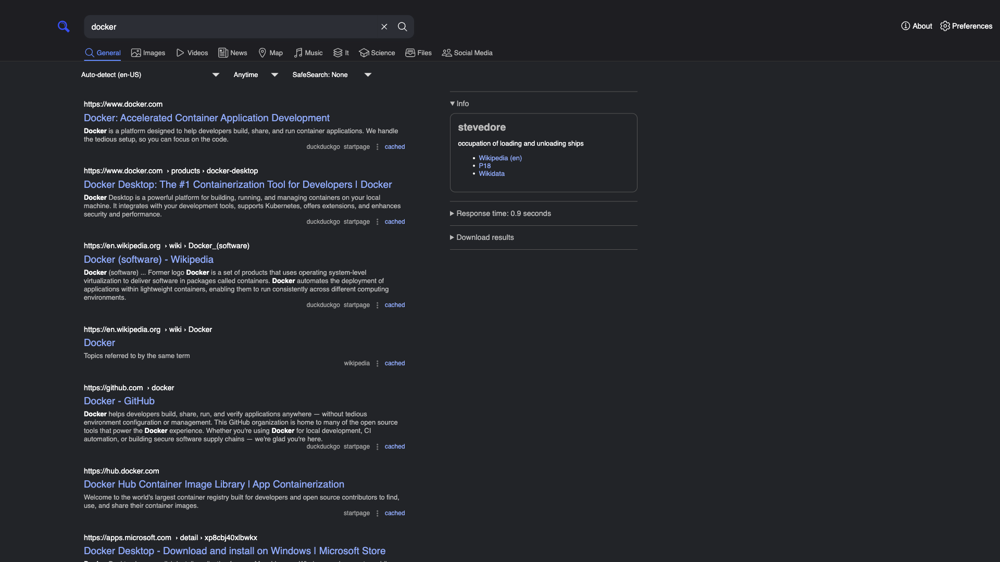

# SearXNG

Self-hosted meta-search engine that aggregates results from 70+ upstream search
engines. Provides both a web UI and a JSON API, with no tracking or profiling.



## Usage

```bash
make docker-up
```

- Open http://localhost:8080 and run a query — the results page aggregates hits
  from the configured upstream engines.
- JSON API is on the same port: `http://localhost:8080/search?q=<query>&format=json`

No authentication.

<details>
<summary>API example</summary>

```bash
curl "http://localhost:8080/search?q=hello+world&format=json"
```

</details>

## Services

| Container | Port(s) | Description |
|-----------|---------|-------------|
| **searxng** | `8080` | SearXNG search engine (web UI + JSON API) |
| **redis** | — | Valkey (Redis-compatible) backing rate limiting and caching |

## Configuration

Search behaviour is configured in `settings.yml`:

| Setting | Notes |
|---------|-------|
| `server.secret_key` | Instance secret key — **change** for real use |
| `search.safe_search` | Safe-search level (`0` off, `1` moderate, `2` strict) |
| `search.default_lang` | Default search language |
| `ui.theme_args.simple_style` | Theme (`dark` or `light`) |

## Volumes

| Path | Contents |
|------|----------|
| `.docker/data/` | SearXNG runtime data |
| `settings.yml` | Bind-mounted config (read-only) |

## Observability

| Check | Endpoint / Command |
|-------|--------------------|
| Health | `curl http://localhost:8080/healthz` |
| Logs | `docker compose logs -f searxng` |

## Resources

- GitHub: https://github.com/searxng/searxng
- Docs: https://docs.searxng.org
