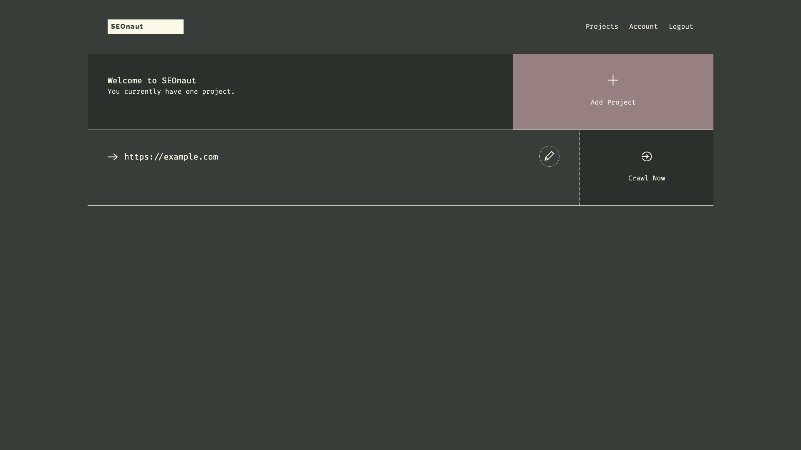

# SEOnaut

Open-source SEO auditing tool that crawls websites and identifies issues
affecting search engine rankings, including broken links, redirect problems,
duplicate meta tags, and heading-structure errors.



## Usage

```bash
make docker-up
```

Open the UI at http://localhost:9000. On first run there are no accounts —
click **Sign up**, register with an email + password (e.g.
`admin@seonaut.local` / `Passw0rd!`), then sign in. On the projects dashboard,
**Add Project** (any URL) and **Crawl Now** to run an audit.

> The `seonaut` container `depends_on` the MySQL `db` with
> `condition: service_healthy`, so it only starts once MySQL passes its
> `mysqladmin ping` check. MySQL runs `linux/amd64` under emulation on Apple
> Silicon; the initial `mysql:8.4` data-dir setup is the slowest part of a cold
> start (~15–20s). No config changes are required — boots cleanly with
> `make docker-up`.

## Services

| Container | Port(s) | Description |
|-----------|---------|-------------|
| **seonaut** | `9000` | SEOnaut web application (crawler + UI) |
| **db** | — | MySQL 8.4 database |

## Configuration

Credentials set in `docker-compose.yml` (sandbox-safe defaults):

| Variable | Default | Notes |
|----------|---------|-------|
| `MYSQL_ROOT_PASSWORD` | `root` | MySQL root password; **change** for real use |
| `SEONAUT_DATABASE_USER` | `seonaut` | App DB user |
| `SEONAUT_DATABASE_PASSWORD` | `seonaut` | App DB password; **change** for real use |
| `SEONAUT_DATABASE_DATABASE` | `seonaut` | Database name |

## Volumes

| Path | Contents |
|------|----------|
| `.docker/mysql/` | MySQL data (accounts, projects, crawl results) |

## Observability

| Check | Endpoint / Command |
|-------|--------------------|
| DB health | `docker compose exec db mysqladmin ping -h 127.0.0.1 -u root -proot` |
| Logs | `docker compose logs -f seonaut` |

## Resources

- GitHub: https://github.com/StJudeWasHere/seonaut
- Docs: https://seonaut.org
