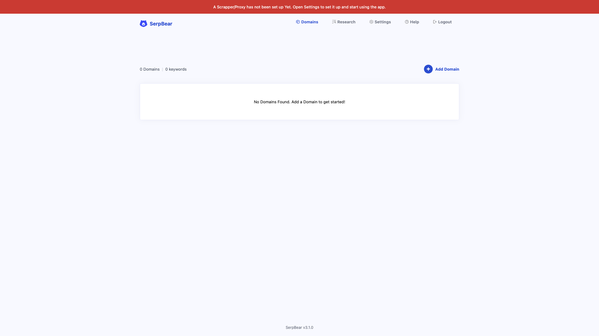

# SerpBear

Open-source search engine position tracking app. Monitors Google keyword
rankings and sends notifications on position changes. Data is stored in a local
SQLite database.



## Usage

```bash
make docker-up
```

Open http://localhost:3000 and log in with the credentials from
`docker-compose.yml` (`admin` / `admin`). After logging in, add a domain and its
keywords to start tracking search positions on the dashboard.

## Services

| Container | Port(s) | Description |
|-----------|---------|-------------|
| **serpbear** | `3000` | SerpBear web application (Next.js + SQLite) |

## Configuration

Environment variables set in `docker-compose.yml` (sandbox-safe defaults):

| Variable | Default | Notes |
|----------|---------|-------|
| `USER_NAME` | `admin` | Login username |
| `PASSWORD` | `admin` | Login password; **change** for real use |
| `SECRET` | `serpbear-secret-key-change-me` | Session secret; **change** for real use |
| `APIKEY` | `serpbear-api-key-change-me` | API key for external access; **change** for real use |
| `SESSION_DURATION` | `24` | Session duration in hours |

## Volumes

| Path | Contents |
|------|----------|
| `.docker/data/` | Application data (SQLite database) |

## Observability

| Check | Endpoint / Command |
|-------|--------------------|
| Health | `curl -I http://localhost:3000/` |
| Logs | `docker compose logs -f serpbear` |

## Resources

- GitHub: https://github.com/towfiqi/serpbear
- Docs: https://docs.serpbear.com
