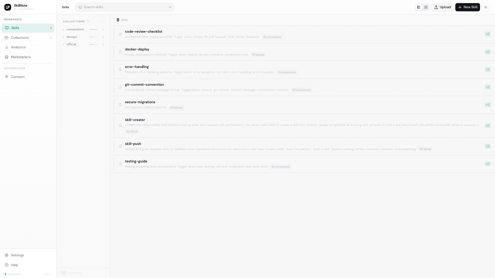

# SkillNote

Self-hosted [SkillNote](https://github.com/luna-prompts/skillnote) — the
open-source **skill registry for AI coding agents**. Create, manage, version and
distribute `SKILL.md` files across Claude Code, Cursor, Codex, OpenHands and
others. TypeScript/Next.js web UI + FastAPI backend + PostgreSQL.

Uses the upstream pinned pre-built images
(`ghcr.io/luna-prompts/skillnote-{api,web}:0.5.4`); based on the canonical
[`deploy/docker-compose.yml`](https://github.com/luna-prompts/skillnote/blob/master/deploy/docker-compose.yml).



## Services

- **web**: Next.js UI
- **api**: FastAPI backend (runs migrations + seeds example skills on first boot)
- **postgres**: PostgreSQL 16

## Ports

- `3000`: web UI (`SKILLNOTE_WEB_PORT`)
- `8082`: API — `/health` (`SKILLNOTE_API_PORT`)

## Usage

```bash
make docker-up
```

Then open http://localhost:3000. First boot runs Alembic migrations and seeds a
set of example skills (`skill-creator`, `docker-deploy`, `testing-guide`, ...);
watch `docker compose logs -f api` until the health check passes.

## Configuration

| Variable | Description | Default |
|----------|-------------|---------|
| `SKILLNOTE_WEB_PORT` | Web UI host port | `3000` |
| `SKILLNOTE_API_PORT` | API host port | `8082` |
| `SKILLNOTE_HOST` | Host/IP used in UI URLs + CORS (set to your LAN IP to reach it from other devices) | `localhost` |
| `SKILLNOTE_DB_PASSWORD` | Postgres password (Postgres reads it only on first init — wipe `.docker/postgres` to change) | `skillnote` |

## Notes

- **No authentication.** The API and UI have no auth layer — safe on localhost
  only. Put a reverse proxy + auth in front before exposing ports 3000/8082.
- **`api` runs as root.** The `bundles` mount comes up root-owned while the
  image's default `app` user can't create bundle subdirs, so seeding fails with
  a `PermissionError`. `user: "0:0"` on the api service works around this for
  the sandbox; for a hardened deploy, drop it and pre-`chown` the mount to the
  image's `app` uid (100:101) instead.
- The upstream MCP service (`Dockerfile.mcp`) is omitted here, matching the
  canonical end-user deploy compose.

## Data & persistence

State lives under `.docker/` (gitignored):

| Path | Contents |
|------|----------|
| `.docker/postgres/` | PostgreSQL data |
| `.docker/bundles/` | stored skill bundles (`SKILL.md` payloads) |

Reset the instance by stopping it and deleting `.docker/`.
