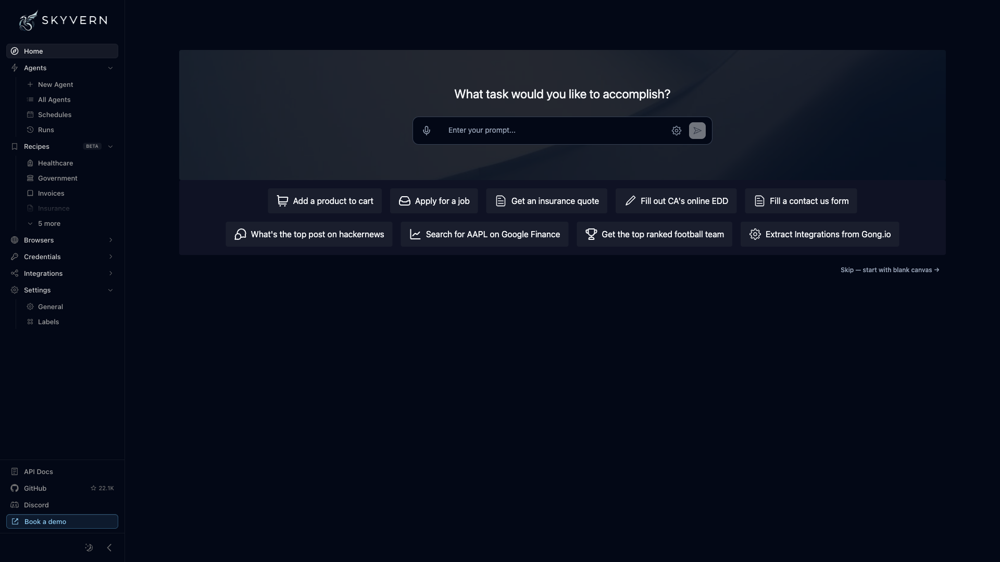

# Skyvern

AI-powered browser automation platform that automates complex workflows on any
website using natural-language instructions. Ships an API server, a web UI, and
a PostgreSQL backing store.



## Usage

```bash
make docker-up
```

Open the UI at http://localhost:8080 (`/discover`). Verify the API with
`curl http://localhost:8000/api/v1/heartbeat` → `Server is running.`

> Boots cleanly with `make docker-up` — no config changes needed. On first boot
> Postgres initialises and `skyvern` runs DB migrations; the `skyvern` healthcheck
> waits for `/app/.streamlit/secrets.toml` (mounted from `.streamlit/`, which ships
> a pre-seeded org `Skyvern` + backend JWT credential), so the stack is usually
> healthy within ~30s.
>
> First load may show a **"Frontend API key missing"** notice — the compose ships a
> placeholder `VITE_SKYVERN_API_KEY=YOUR_API_KEY`. Click **Regenerate API key** in
> the UI to persist a working key. Set a real `GEMINI_API_KEY` (and
> `VITE_SKYVERN_API_KEY`) in `docker-compose.yml` before running actual automation
> tasks with an LLM.

## Services

| Container | Port(s) | Description |
|-----------|---------|-------------|
| **skyvern-ui** | `8080`, `9090` | Web interface (`8080`) and artifact server (`9090`) |
| **skyvern** | `8000`, `9222` | API server (`8000`) and Chrome DevTools Protocol for CDP browser forwarding (`9222`) |
| **postgres** | `5432` | PostgreSQL 14 database |

## Configuration

Environment variables set in `docker-compose.yml` (sandbox-safe defaults):

| Variable | Default | Notes |
|----------|---------|-------|
| `GEMINI_API_KEY` | `YOUR_GEMINI_KEY` | LLM key; **change** to run real automation |
| `LLM_KEY` | `GEMINI_2.5_FLASH_PREVIEW` | Selected LLM model |
| `BROWSER_TYPE` | `chromium-headful` | Browser mode |
| `MAX_STEPS_PER_RUN` | `50` | Step cap per automation run |
| `VITE_SKYVERN_API_KEY` | `YOUR_API_KEY` | Frontend API key; **change** (or regenerate in UI) |
| `POSTGRES_USER` / `POSTGRES_PASSWORD` | `skyvern` / `skyvern` | DB credentials; **change** for real use |

## Volumes

| Path | Contents |
|------|----------|
| `.docker/postgres/` | PostgreSQL data |
| `.docker/artifacts/` | Run artifacts |
| `.docker/videos/` | Recorded run videos |
| `.docker/har/` | HAR network captures |
| `.docker/log/` | Application logs |

## Observability

| Check | Endpoint / Command |
|-------|--------------------|
| API heartbeat | `curl http://localhost:8000/api/v1/heartbeat` |
| DB health | `docker compose exec postgres pg_isready -U skyvern` |
| Logs | `docker compose logs -f skyvern` |

## Resources

- GitHub: https://github.com/Skyvern-AI/skyvern
- Docs: https://docs.skyvern.com
