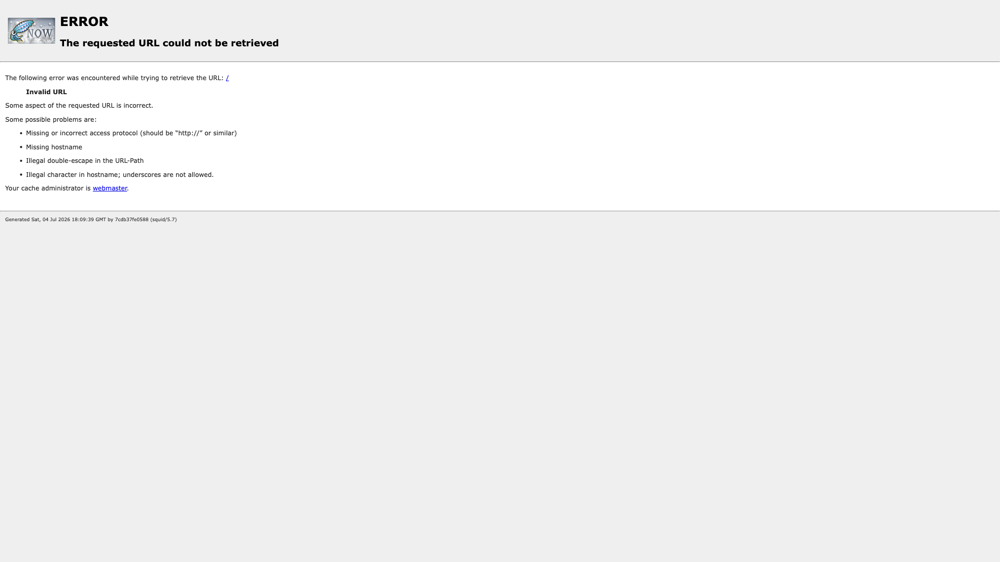

# Squid Forward Proxy

A [Squid](http://www.squid-cache.org/) forward proxy with SSL-Bump (HTTPS
interception) that chains all traffic to an upstream parent proxy. Built locally
from `debian:bookworm-slim` (installs `squid-openssl`) and published on host port
**3128**.



## Usage

This is a **local `build:` stack** — build it before first run:

```bash
make docker-up            # or: docker compose up -d --build
```

Squid listens on `3128` with `ssl-bump` enabled, generating per-host
certificates on the fly from the bundled CA (`squid/squid-ca.pem`). Every request
is forwarded to the parent proxy configured via env vars (default
`p.webshare.io:80` with placeholder credentials). Regenerate the CA with
`make ssl` if needed.

> A direct `GET http://localhost:3128/` (no proxy target) returns a
> Squid-generated **"ERROR: The requested URL could not be retrieved"** page —
> that is the screenshot above and confirms Squid is up. With placeholder upstream
> credentials, proxying to the real internet returns **407 Proxy Authentication
> Required** from the parent until real credentials are supplied.
>
> **SSL-Bump requires the OpenSSL build of Squid.** Debian's plain `squid` package
> is compiled without OpenSSL (`ssl-bump` fails with `Unknown http_port option`),
> so the Dockerfile installs `squid-openssl`. `security_file_certgen` lives at
> `/usr/lib/squid/` on Debian (not `/usr/lib64/`), and the SSL cert DB is
> initialized on startup by the entrypoint before Squid launches.

<details><summary>Using it as a proxy</summary>

```bash
# HTTP request routed through Squid
curl -x http://localhost:3128 http://example.com

# HTTPS with SSL-Bump — trust the bundled CA or skip verification
curl -x http://localhost:3128 --cacert squid/squid-ca.pem https://example.com
```

</details>

## Services

| Container | Port(s) | Description |
|-----------|---------|-------------|
| **squid** | `3128` | Locally built Squid proxy with SSL-Bump, chaining to a parent proxy |

## Configuration

Environment variables set in `docker-compose.yml` (placeholder defaults):

| Variable | Default | Notes |
|----------|---------|-------|
| `PROXY_HOST` | `p.webshare.io` | Parent proxy host |
| `PROXY_PORT` | `80` | Parent proxy port |
| `PROXY_USER` | `foo` | Parent proxy username; **change** to reach the internet |
| `PROXY_PASS` | `bar` | Parent proxy password; **change** to reach the internet |

## Volumes

| Path | Contents |
|------|----------|
| `.docker/squid/data/` | Squid cache/data |
| `.docker/squid/logs/` | Squid access/cache logs |

## Observability

| Check | Endpoint / Command |
|-------|--------------------|
| Proxy up | `curl -x http://localhost:3128 http://example.com` |
| Logs | `docker compose logs -f squid` |

## Resources

- Docs: http://www.squid-cache.org/
- SSL-Bump: https://wiki.squid-cache.org/Features/SslBump
