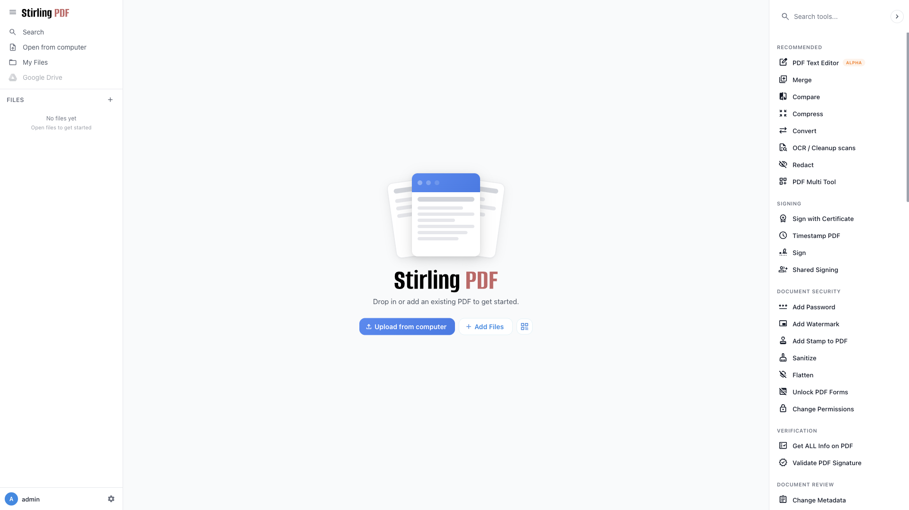

# Stirling-PDF

Self-hosted PDF manipulation toolkit. Merge, split, convert, OCR, compress, and
watermark PDF files through a web UI.



## Usage

```bash
make docker-up
```

Open http://localhost:8080 — the PDF toolkit UI opens directly with no login
prompt.

> **No authentication:** `docker-compose.yml` sets `DOCKER_ENABLE_SECURITY: "false"`,
> so the login/user system is disabled. To enable the built-in login (default
> `admin` / `stirling`, which forces a password change on first sign-in), set
> `DOCKER_ENABLE_SECURITY: "true"`.

## Services

| Container | Port(s) | Description |
|-----------|---------|-------------|
| **stirling-pdf** | `8080` | Stirling-PDF web application |

## Configuration

Environment variables set in `docker-compose.yml`:

| Variable | Default | Notes |
|----------|---------|-------|
| `DOCKER_ENABLE_SECURITY` | `false` | Set `true` to enable the login/user system |

## Volumes

| Path | Contents |
|------|----------|
| `.docker/configs/` | Application configuration |
| `.docker/logs/` | Application logs |

## Observability

| Check | Endpoint / Command |
|-------|--------------------|
| Health | `curl -I http://localhost:8080/` |
| Logs | `docker compose logs -f stirling-pdf` |

## Resources

- GitHub: https://github.com/Stirling-Tools/Stirling-PDF
- Docs: https://docs.stirlingpdf.com
