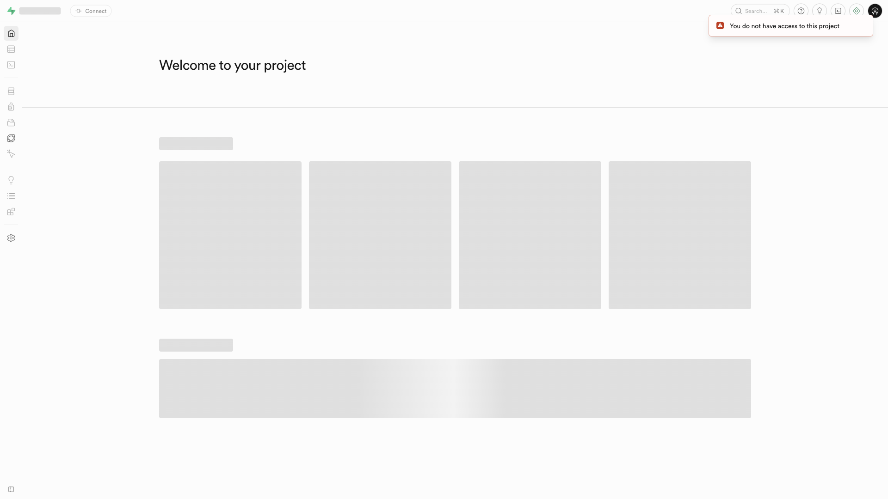

# Supabase

Self-hosted Supabase backend platform: PostgreSQL, authentication (GoTrue), an
auto-generated REST API (PostgREST), realtime subscriptions, file storage, edge
functions (Deno), log analytics (Logflare), a connection pooler (Supavisor), and
the Studio dashboard UI — all fronted by a Kong API gateway.



## Usage

```bash
make docker-up
```

This is a large stack (13 containers). First boot pulls several GB of images and
can take a few minutes before Kong/Studio answer on port 8000. Studio is served
through Kong behind HTTP basic auth — open http://localhost:8000 and log in with
`DASHBOARD_USERNAME` / `DASHBOARD_PASSWORD` (default `supabase` / `supabase`).

```bash
curl -sf -o /dev/null -w '%{http_code}\n' http://localhost:8000   # 401 = Kong up
```

> **Reset:** this stack uses **named Docker volumes** (`db-config`, `deno-cache`)
> in addition to `.docker/`, so a full reset needs `-v`:
> `docker compose down -v && docker compose up -d`.
>
> **`VAULT_ENC_KEY` must be exactly 32 bytes.** Supavisor encrypts tenant secrets
> with AES-256-GCM, which rejects any other length and crash-loops; the sandbox
> default is a 32-char key for this reason.
>
> **`functions` (edge runtime) crash-loops in the default sandbox** because no
> `main` edge function is mounted under `.docker/functions/main`. It is independent —
> Studio/API work without it. Drop a `main/index.ts` into `.docker/functions/` if
> you need edge functions.
>
> Hardcoded credentials and the bundled demo JWT keys are **local sandbox defaults
> only** — never treat them as production-safe.

<details><summary>API examples</summary>

- Dashboard: http://localhost:8000 (login `supabase` / `supabase`)
- REST API: http://localhost:8000/rest/v1/
- Auth API: http://localhost:8000/auth/v1/
- Storage API: http://localhost:8000/storage/v1/
- PostgreSQL direct: `localhost:5432` (via Supavisor)
- PostgreSQL transaction pooler: `localhost:6543`

</details>

## Services

| Container | Port(s) | Description |
|-----------|---------|-------------|
| **kong** | `8000`, `8443` | API gateway — routes all client requests (HTTP + HTTPS) |
| **supavisor** | `5432`, `6543` | Connection pooler — Postgres direct (`5432`) and transaction pooler (`6543`) |
| **studio** | — | Supabase dashboard UI |
| **auth** | — | GoTrue authentication server |
| **rest** | — | PostgREST auto-generated REST API |
| **realtime** | — | Realtime WebSocket subscriptions |
| **storage** | — | File storage service |
| **imgproxy** | — | Image transformation proxy |
| **meta** | — | Postgres metadata API |
| **functions** | — | Deno edge-functions runtime |
| **analytics** | — | Logflare log analytics |
| **db** | — | PostgreSQL 15 database |
| **vector** | — | Log aggregation agent (reads Docker logs) |

## Configuration

Key settings in `.env` (sandbox-safe defaults):

| Variable | Default | Notes |
|----------|---------|-------|
| `POSTGRES_PASSWORD` | `supabase-sandbox` | Database password; **change** for real use |
| `JWT_SECRET` | demo secret | Signs `ANON_KEY` / `SERVICE_ROLE_KEY`; **change** for real use |
| `ANON_KEY` / `SERVICE_ROLE_KEY` | demo JWTs | API keys signed with `JWT_SECRET`; **change** for real use |
| `DASHBOARD_USERNAME` / `DASHBOARD_PASSWORD` | `supabase` / `supabase` | Studio basic-auth login; **change** for real use |
| `VAULT_ENC_KEY` | 32-char sandbox key | Supavisor AES-256-GCM key — must be exactly 32 bytes |
| `SECRET_KEY_BASE` | sandbox 64-char key | Realtime/Supavisor Phoenix secret; **change** for real use |

The default `.env` includes working demo JWT keys from the Supabase docs. For
production, generate new keys per the
[self-hosting guide](https://supabase.com/docs/guides/self-hosting/docker#generate-api-keys).

## Volumes

| Path | Contents |
|------|----------|
| `.docker/db/data/` | PostgreSQL data |
| `.docker/storage/` | Uploaded files (storage backend) |
| `.docker/functions/` | Edge function source (mount `main/` here) |
| `.docker/snippets/` | Studio SQL snippets |
| `db-config` (named volume) | Postgres custom config |
| `deno-cache` (named volume) | Deno module cache for edge runtime |

## Observability

| Check | Endpoint / Command |
|-------|--------------------|
| Gateway up | `curl -s -o /dev/null -w '%{http_code}' http://localhost:8000` (401 = Kong up) |
| DB health | `docker compose exec db pg_isready -U postgres -h localhost` |
| Logs | `docker compose logs -f kong` |

## Resources

- GitHub: https://github.com/supabase/supabase
- Docs: https://supabase.com/docs/guides/self-hosting/docker
