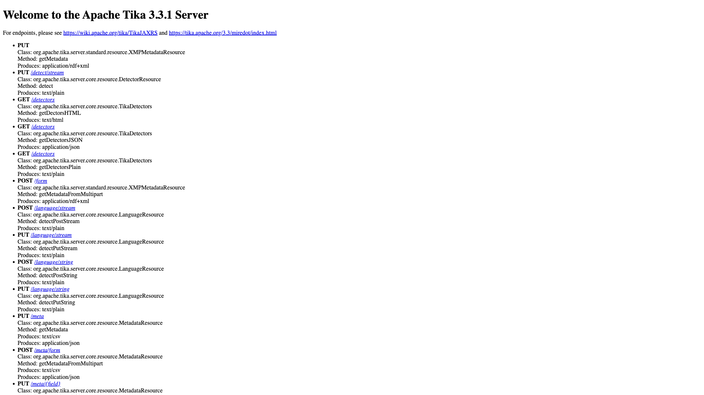

# Apache Tika

Content detection and extraction toolkit. Extracts text, metadata, and
structured content from over 1000 file formats. API-first — the root `/` page
is a static welcome/endpoint listing; real work is done by PUT/POST-ing files
to endpoints like `/tika`, `/meta`, and `/detect/stream`.



## Usage

```bash
make docker-up
```

Hit the server at http://localhost:9998/ — the root serves a "Welcome to the
Apache Tika Server" page listing all endpoints. Sample extraction:

```bash
curl -T file.pdf http://localhost:9998/tika
```

> Boots quickly and returns HTTP 200 on `/` within a few seconds — no config or
> persistent state required. Default host port is `9998`; if it clashes with
> another running stack, remap via a gitignored `docker-compose.override.yml`
> (`ports: !override`).

<details><summary>API examples</summary>

Extract plain text from a document:

```bash
curl -T document.pdf http://localhost:9998/tika --header "Accept: text/plain"
```

Extract metadata as JSON:

```bash
curl -T document.pdf http://localhost:9998/meta --header "Accept: application/json"
```

Detect file type:

```bash
curl -T document.pdf http://localhost:9998/detect/stream
```

</details>

## Services

| Container | Port(s) | Description |
|-----------|---------|-------------|
| **tika** | `9998` | Apache Tika server (REST content detection/extraction) |

## Configuration

None — no environment variables; runs with image defaults.

## Volumes

None — stateless.

## Observability

| Check | Endpoint / Command |
|-------|--------------------|
| Health | `curl -s -o /dev/null -w "%{http_code}" http://localhost:9998/` (200 when up) |
| Logs | `docker compose logs -f tika` |

## Resources

- GitHub: https://github.com/apache/tika
- Docs: https://tika.apache.org/
