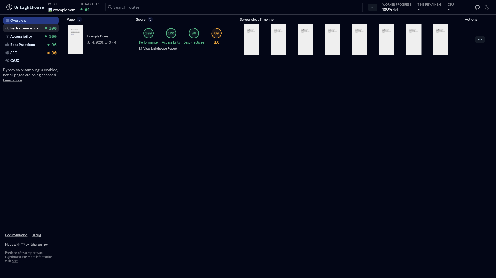

# Unlighthouse

Scans an entire website with Google Lighthouse and presents results in a web
dashboard. Provides performance, accessibility, best practices, and SEO scores
for every discovered route.



## Usage

```bash
make docker-up
```

Open the dashboard at http://localhost:5678. Unlighthouse crawls the target
`SITE`, runs Lighthouse on each discovered route, and the dashboard populates
live with per-route and total scores as results come in.

> First boot pulls the `ghcr.io/indykoning/unlighthouse-docker:master` image
> (~430 MB) and needs outbound internet to reach the target site. For a
> single-page target like `example.com` only `/` is scanned (no sitemap or
> internal links to crawl), so the dashboard shows one scored route; a real
> multi-page site populates many routes.

## Services

| Container | Port(s) | Description |
|-----------|---------|-------------|
| **unlighthouse** | `5678` | Unlighthouse crawler + web dashboard |

## Configuration

Environment variable in `docker-compose.yml`:

| Variable | Default | Notes |
|----------|---------|-------|
| `SITE` | `https://example.com` | Target website URL to scan — **change** to the site you want to audit |

## Volumes

None — stateless.

## Observability

| Check | Endpoint / Command |
|-------|--------------------|
| UI / status | Open http://localhost:5678 (scan progress shown live) |
| Logs | `docker compose logs -f unlighthouse` |

## Resources

- GitHub (image): https://github.com/indykoning/docker-unlighthouse
- Docs: https://unlighthouse.dev/
