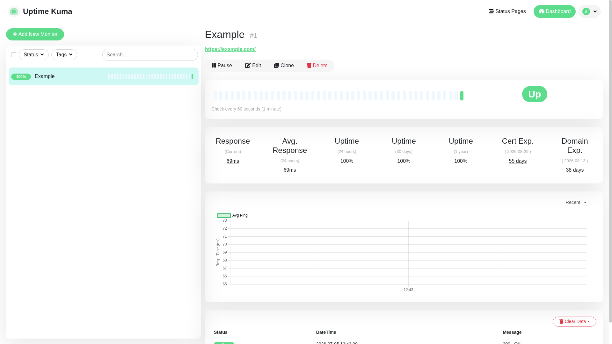

# Uptime Kuma

Self-hosted uptime monitoring dashboard. Monitors HTTP(S), TCP, DNS, ping,
Docker containers, and more, with status pages, response-time charts, and 90+
notification integrations (Slack, Telegram, email, webhooks, ...).

First boot opens a setup wizard at http://localhost:3001 where you create the
admin account — there are no default credentials. Any account created here is
local-only sandbox data (stored in `.docker/data/`, gitignored).



## Usage

```bash
make docker-up
```

Open http://localhost:3001 — the first visit runs the setup wizard (choose the
default SQLite database and create the admin account), then add monitors from
the dashboard.

## Services

| Container | Port(s) | Description |
|-----------|---------|-------------|
| **uptime-kuma** | `3001` | Uptime Kuma server (web UI + Socket.io API) |

## Configuration

No environment variables required for local use. Common optional ones (set in
`docker-compose.yml`):

| Variable | Default | Notes |
|----------|---------|-------|
| `UPTIME_KUMA_PORT` | `3001` | Port the server listens on inside the container |
| `UPTIME_KUMA_DB_TYPE` | `sqlite` | Embedded SQLite by default; MariaDB supported for real use |

## Volumes

| Path | Contents |
|------|----------|
| `.docker/data/` | SQLite database, uploads, and settings (`/app/data`) |

## Observability

| Check | Endpoint / Command |
|-------|--------------------|
| Health | `docker compose ps` (built-in `extra/healthcheck` probe) |
| Entry page | `curl http://localhost:3001/api/entry-page` |
| Metrics | `http://localhost:3001/metrics` (Prometheus, requires auth) |
| Logs | `docker compose logs -f uptime-kuma` |

## Resources

- GitHub: https://github.com/louislam/uptime-kuma
- Docs: https://github.com/louislam/uptime-kuma/wiki
