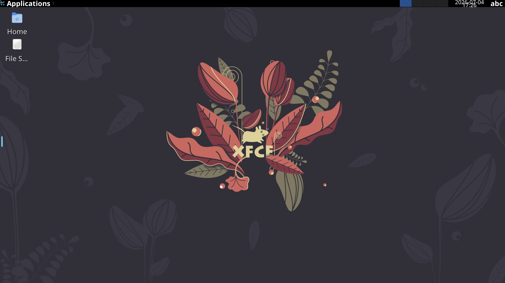

# Webtop Browser

A containerized Linux desktop environment accessible via web browser, using
LinuxServer.io's Webtop image. Provides a full XFCE desktop (Selkies/KasmVNC)
rendered in the browser — useful for browser-based computing or running
applications in an isolated environment.



## Usage

```bash
make docker-up
```

Open the web desktop:

- HTTP:  http://localhost:3000
- HTTPS: https://localhost:3001 (self-signed cert — accept the warning)

No password is set by default (the image ships without auth for local use). The
UI is a full XFCE desktop drawn on a `<canvas>`, with a control sidebar for
clipboard, files, audio and video settings.

> Boots cleanly on OrbStack/macOS with a plain `docker compose up -d` — no
> `platform:` override or GPU flags (both `amd64` and `arm64` are published).
> First run pulls a large multi-hundred-MB image; allow a few minutes. The
> desktop needs a few seconds after `Up` to paint Selkies — if the canvas is
> black, wait and reload. Remap host ports `3000`/`3001` via a gitignored
> `docker-compose.override.yml` (`ports: !override`) if they clash.

## Services

| Container | Port(s) | Description |
|-----------|---------|-------------|
| **webtop** | `3000` (HTTP), `3001` (HTTPS) | LinuxServer.io Webtop XFCE desktop over the web |

## Configuration

Environment variables in `docker-compose.yml`:

| Variable | Default | Notes |
|----------|---------|-------|
| `PUID` | `1000` | User ID for file permissions |
| `PGID` | `1000` | Group ID for file permissions |
| `TZ` | `Etc/UTC` | Timezone |
| `SUBFOLDER` | `/` | Web subfolder path |
| `TITLE` | `Ynfra` | Browser title for the interface |

## Volumes

| Path | Contents |
|------|----------|
| `.docker/config/` | Desktop config and user home (`/config`) |

## Observability

| Check | Endpoint / Command |
|-------|--------------------|
| UI | Open http://localhost:3000 |
| Logs | `docker compose logs -f webtop` |

## Resources

- GitHub: https://github.com/linuxserver/docker-webtop
- Docs: https://docs.linuxserver.io/images/docker-webtop/
