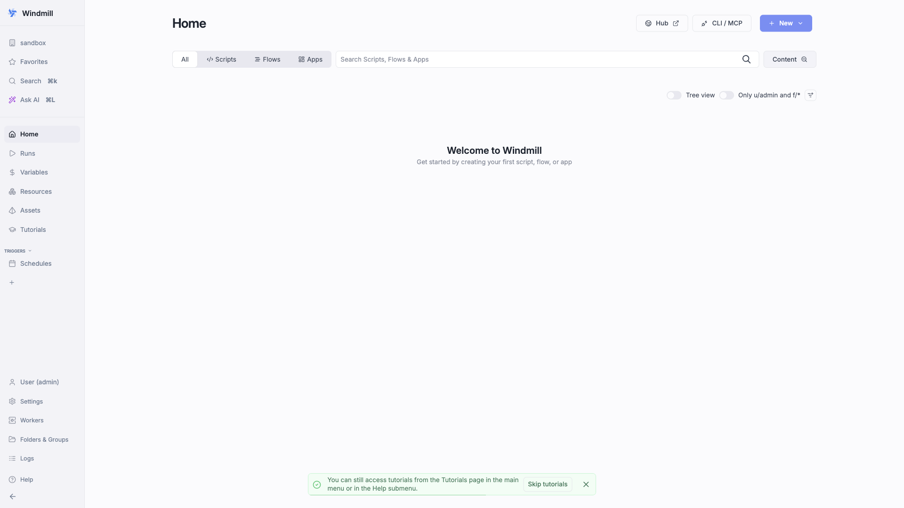

# Windmill

Developer platform and workflow engine for turning scripts (Python, TypeScript,
Go, Bash, SQL) into UIs, APIs, and scheduled jobs. This stack runs the server,
a worker, the language server, PostgreSQL, and a Caddy reverse proxy.



## Usage

```bash
make docker-up
```

- **UI:** the Windmill server is published directly on http://localhost:8000
  (the Caddy reverse proxy is also exposed on http://localhost:8080).
- **Default superadmin:** `admin@windmill.dev` / `changeme` (the login form
  pre-fills the email). Change the password from the user menu once inside.
- **First-run setup:** on first login, click **Skip** on the "First Time Setup"
  screen, then **Create a new workspace** before reaching the Home dashboard.

> Postgres migrations run on first boot, so the server can take a short while
> before http://localhost:8000 returns 200 on a cold start. The `windmill_worker`
> mounts the host Docker socket (`/var/run/docker.sock`) so it can run
> containerised jobs — host-root-equivalent, keep it local-only. `$WM_IMAGE`
> (from `.env`) runs both the `server` (`MODE=server`) and `worker`
> (`MODE=worker`) services.

## Services

| Container | Port(s) | Description |
|-----------|---------|-------------|
| **windmill_server** | `8000` | Windmill API + web UI (`MODE=server`) |
| **caddy** | `8080` → `80` | Reverse proxy (routes `/ws/*` to LSP, rest to the server) |
| **windmill_worker** | — | Executes jobs (`MODE=worker`); mounts the host Docker socket |
| **lsp** | — | Windmill language server (editor autocomplete) |
| **db** | `5432` | PostgreSQL 14 state store |

## Configuration

Environment variables in `.env` (sandbox-safe defaults):

| Variable | Default | Notes |
|----------|---------|-------|
| `DATABASE_URL` | `postgres://postgres:windmill@db/windmill?sslmode=disable` | Server + worker DB connection — **change** password for real use |
| `WM_IMAGE` | `ghcr.io/windmill-labs/windmill:main` | Image used by both server and worker |
| `POSTGRES_PASSWORD` | `windmill` | Postgres password (set in compose) — **change** for real use |
| `POSTGRES_DB` | `windmill` | Postgres database name |

## Volumes

| Path | Contents |
|------|----------|
| `.docker/data/postgres/` | PostgreSQL data |
| `.docker/data/worker/` | Worker cache (`/tmp/windmill/cache`) |
| `.docker/data/lsp/` | Language-server cache |

## Observability

| Check | Endpoint / Command |
|-------|--------------------|
| DB health | `docker compose exec db pg_isready -U postgres` |
| UI | Open http://localhost:8000 |
| Logs | `docker compose logs -f windmill_server` |

## Resources

- GitHub: https://github.com/windmill-labs/windmill
- Docs: https://www.windmill.dev/docs/intro
