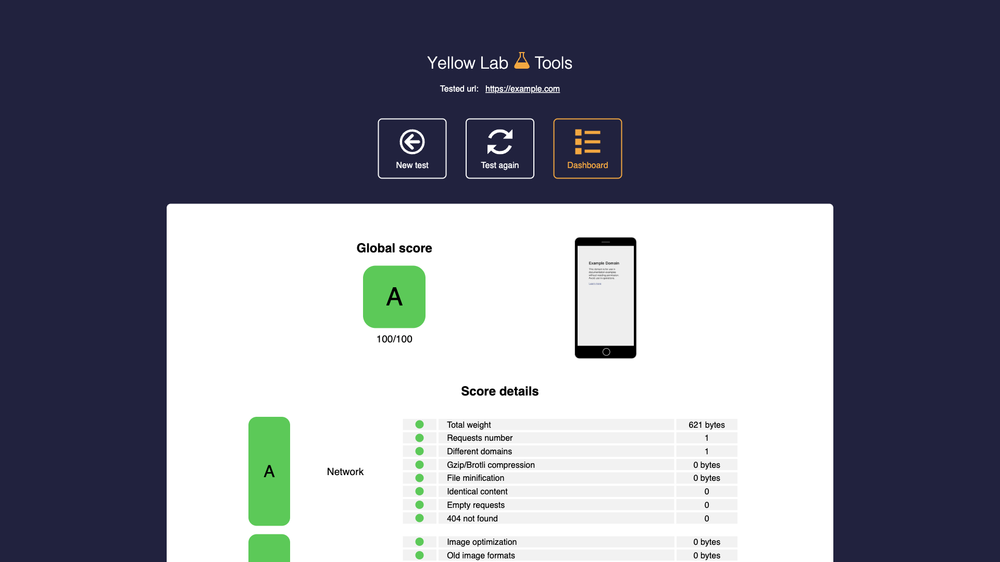

# Yellow Lab Tools

Web page analysis tool that detects performance and front-end code quality
issues. Scores pages on page weight, requests, DOM complexity, CSS/JavaScript
complexity, and best practices.



## Usage

```bash
make docker-up
```

Open http://localhost:8383, type a URL (e.g. `https://example.com`) into the
input box, and click **Launch test**. The job goes through a short queue
(`/queue/<id>`) and then redirects to the results dashboard (`/result/<id>`)
showing the global grade and per-category score details.

> **Chromium sandbox / `security_opt`.** Each audit runs a headless Chromium
> (via Phantomas/Puppeteer). The default Docker seccomp profile blocks the
> syscalls Chromium needs to create its sandbox namespaces, so every analysis
> fails with `Failed to move to new namespace ... Operation not permitted` and
> never leaves the queue. The compose sets `security_opt: [seccomp:unconfined]`
> so the browser can launch. The web UI boots fine without it — only the
> analysis step needs it.

## Services

| Container | Port(s) | Description |
|-----------|---------|-------------|
| **yellowlabtools** | `8383` | Yellow Lab Tools web app + analysis queue |

## Configuration

None — no environment variables; runs with image defaults. The compose sets
`security_opt: [seccomp:unconfined]` so headless Chromium can launch.

## Volumes

None — stateless.

## Observability

| Check | Endpoint / Command |
|-------|--------------------|
| UI | Open http://localhost:8383 |
| Logs | `docker compose logs -f yellowlabtools` |

## Resources

- GitHub: https://github.com/YellowLabTools/YellowLabTools
- Docs: https://yellowlab.tools/
