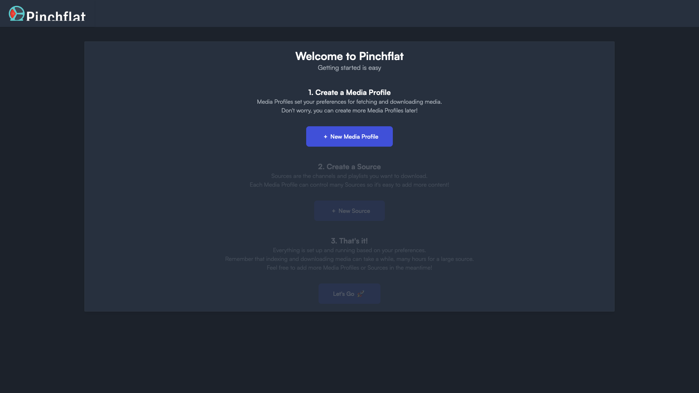

# YouTube Downloader

Bundles two self-hosted YouTube media downloaders in one stack: **Pinchflat**
(channel/playlist archiver with a rich dashboard) and **MeTube** (single-URL
downloader). Run one or both; each has its own web UI.



## Usage

```bash
make docker-up
```

Two web UIs become available:

- **Pinchflat** — http://localhost:8945 (channel/playlist archiver, richer dashboard)
- **MeTube** — http://localhost:8081 (single URL downloader)

No login is required by default.

> **Pinchflat has no `arm64` image.** `ghcr.io/kieraneglin/pinchflat:latest`
> publishes only a `linux/amd64` manifest, so on Apple-silicon / arm64 hosts a
> plain `docker compose up -d` fails with `no matching manifest for linux/arm64/v8`.
> The compose pins `platform: linux/amd64` on the `pinchflat` service so it runs
> under emulation (OrbStack Rosetta / Docker Desktop QEMU) — a no-op on amd64
> hosts. MeTube ships a native `arm64` image and needs no pin.

## Services

| Container | Port(s) | Description |
|-----------|---------|-------------|
| **pinchflat** | `8945` | Channel/playlist archiver (pinned `platform: linux/amd64`) |
| **metube** | `8081` | Single-URL media downloader |

## Configuration

Environment variables in `docker-compose.yml`:

| Variable | Default | Notes |
|----------|---------|-------|
| `TZ` | `Europe/Prague` | Timezone for the `pinchflat` service |

## Volumes

| Path | Contents |
|------|----------|
| `.docker/pinchflat/config/` | Pinchflat config (`/config`) |
| `.docker/pinchflat/downloads/` | Pinchflat downloads |
| `.docker/metube/downloads/` | MeTube downloads |

## Observability

| Check | Endpoint / Command |
|-------|--------------------|
| Pinchflat UI | Open http://localhost:8945 |
| MeTube UI | Open http://localhost:8081 |
| Logs | `docker compose logs -f pinchflat metube` |

## Resources

- Pinchflat: https://github.com/kieraneglin/pinchflat
- MeTube: https://github.com/alexta69/metube
